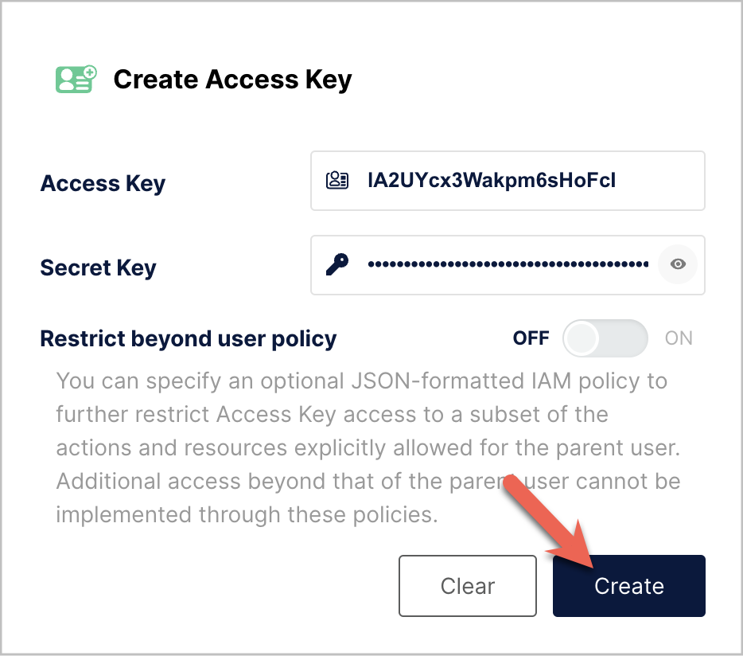
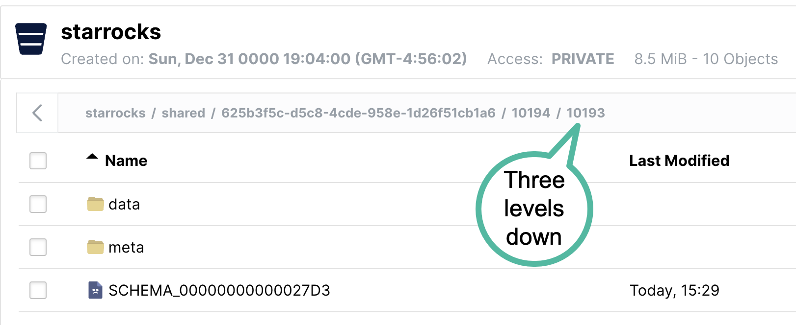

# StarRocks Object Storage lab

import DDL from '../assets/quick-start/_DDL.mdx'
import Clients from '../assets/quick-start/_clients.mdx'
import SQL from '../assets/quick-start/_SQL.mdx'
import Curl from '../assets/quick-start/_curl.mdx'

This tutorial covers:

- Running StarRocks in Docker containers
- Using MinIO for Object Storage
- Loading two public datasets including basic transformation of the data
- Analyzing the data with SELECT and JOIN

The data used is provided by NYC OpenData and the National Centers for Environmental Information.

Both of these datasets are very large, and because this tutorial is intended to help you get exposed to working with StarRocks we are not going to load data for the past 120 years. You can run the Docker image and load this data on a machine with 4 GB RAM assigned to Docker. For larger fault-tolerant and scalable deployments we have other documentation and will provide that later.

## Prerequisites

### Docker

- [Docker Engine](https://docs.docker.com/engine/install/)
- 4 GB RAM assigned to Docker
- 10 GB free disk space assigned to Docker

### SQL client

The SQL clients will be discussed after starting StarRocks as StarRocks needs to be running to configure a client.

### curl

`curl` is used to issue the data load job to StarRocks, and to download the datasets. Check to see if you have it installed by running `curl` or `curl.exe` at your OS prompt. If curl is not installed, [get curl here](https://curl.se/dlwiz/?type=bin).

## Launch StarRocks

To run StarRocks with shared-data using Object Storage we need:

- A frontend engine (FE)
- A compute node (CN)
- Object Storage

This guide uses MinIO, which is S3 compatible Object Storage provided under the GNU Affero General Public License.

In order to provide an environment with the three necessary containers StarRocks provides a Docker compose file. 

```bash
mkdir quickstart
cd quickstart
curl -O https://raw.githubusercontent.com/StarRocks/starrocks/update-quickstart/docs/en/quick_start/_data/docker-compose.yml
```

```bash
docker compose up -d
```

Check the progress of the services. It should take around 30 seconds for the FE and CN to become healthy. The MinIO container will not show a health indicator, but you will be using the MinIO web UI and that will verify its health.

Run `docker compose ps` until the FE and CN show a status of `healthy`:

```bash
docker compose ps
```

```plaintext
SERVICE        CREATED          STATUS                    PORTS
starrocks-cn   25 seconds ago   Up 24 seconds (healthy)   0.0.0.0:8040->8040/tcp
starrocks-fe   25 seconds ago   Up 24 seconds (healthy)   0.0.0.0:8030->8030/tcp, 0.0.0.0:9020->9020/tcp, 0.0.0.0:9030->9030/tcp
minio          25 seconds ago   Up 24 seconds             0.0.0.0:9000-9001->9000-9001/tcp
```
## Generate MinIO credentials

In order to use MinIO for Object Storage with StarRocks you need to generate an **access key**.

### Open the MinIO web UI

Browse to http://localhost:9001/access-keys The username and password are specified in the Docker compose file, and are `minioadmin` and `minioadmin`. You should see that there are no access keys yet. Click **Create access key +**.

MinIO will generate a key, click **Create** and download the key.



:::note
The access key is not saved until you click on **Create**, do not just copy the key and navigate away from the page
:::

## SQL Clients

<Clients />

## Download the data

Download these two datasets to your FE container.

### Open a shell on the FE container

Open a shell and create a directory for the downloaded files:

```bash
docker compose exec starrocks-fe bash
```

```bash
mkdir quickstart
cd quickstart
```

### New York City crash data

```bash
curl -O https://raw.githubusercontent.com/StarRocks/starrocks/b68318323c544552900ec3ad5517e6ad4a1175d5/docs/en/quick_start/_data/NYPD_Crash_Data.csv
```

### Weather data

```bash
curl -O https://raw.githubusercontent.com/StarRocks/starrocks/b68318323c544552900ec3ad5517e6ad4a1175d5/docs/en/quick_start/_data/72505394728.csv
```

## Configure StarRocks for shared-data

At this point you have StarRocks running, and you have MinIO running. The MinIO access key is used to connect StarRocks and Minio.

### Connect to StarRocks

:::tip
If you are using the mysql CLI open a new shell on your system as you will need the shell in the FE for another step in the process.
:::

```sql
mysql -P9030 -h127.0.0.1 -uroot --prompt="StarRocks > "
```

### Create a storage volume

Details for the configuration shown below:

- The MinIO server is available at the URL `http://minio:9000`
- The bucket created above is named `starrocks`
- Data written to this volume will be stored in a folder named `shared` within the bucket `starrocks`
:::tip
The folder `shared` will be created the first time data is written to the volume
:::
- The MinIO server is not using SSL
- The MinIO key and secret are entered as `aws.s3.access_key` and `aws.s3.secret_key`. Use the access key that you created in the MinIO web UI earlier.
- The volume `shared` is the default volume

:::tip
Edit the command before you run it and replace the highlighted access key information with the access key and secret that you created in MinIO.
:::

```bash
CREATE STORAGE VOLUME shared
TYPE = S3
LOCATIONS = ("s3://starrocks/shared/")
PROPERTIES
(
    "enabled" = "true",
    "aws.s3.endpoint" = "http://minio:9000",
    "aws.s3.use_aws_sdk_default_behavior" = "false",
    "aws.s3.enable_ssl" = "false",
    "aws.s3.use_instance_profile" = "false",
    # highlight-start
    "aws.s3.access_key" = "IA2UYcx3Wakpm6sHoFcl",
    "aws.s3.secret_key" = "E33cdRM9MfWpP2FiRpc056Zclg6CntXWa3WPBNMy"
    # highlight-end
);

SET shared AS DEFAULT STORAGE VOLUME;
```

```sql
StarRocks > DESC STORAGE VOLUME shared\G
```

```plaintext
*************************** 1. row ***************************
     Name: shared
     Type: S3
IsDefault: true
# highlight-start
 Location: s3://starrocks/shared/
   Params: {"aws.s3.access_key":"******","aws.s3.secret_key":"******","aws.s3.endpoint":"http://minio:9000","aws.s3.region":"us-east-1","aws.s3.use_instance_profile":"false","aws.s3.use_aws_sdk_default_behavior":"false"}
# highlight-end
  Enabled: true
  Comment:
1 row in set (0.03 sec)
```

:::note
The folder `shared` will not be visible in the MinIO object list until data is written to the bucket.
:::

## Create some tables

<DDL />

## Load two datasets

There are many ways to load data into StarRocks. For this tutorial the simplest way is to use curl and StarRocks Stream Load.

:::tip

Run these curl commands from the FE shell in the directory where you downloaded the dataset.

You will be prompted for a password. You probably have not assigned a password to the MySQL `root` user, so just hit enter.

:::

The `curl` commands look complex, but they are explained in detail at the end of the tutorial. For now, we recommend running the commands and running some SQL to analyze the data, and then reading about the data loading details at the end.

### New York City collision data - Crashes

```bash
curl --location-trusted -u root             \
    -T ./NYPD_Crash_Data.csv                \
    -H "label:crashdata-0"                  \
    -H "column_separator:,"                 \
    -H "skip_header:1"                      \
    -H "enclose:\""                         \
    -H "max_filter_ratio:1"                 \
    -H "columns:tmp_CRASH_DATE, tmp_CRASH_TIME, CRASH_DATE=str_to_date(concat_ws(' ', tmp_CRASH_DATE, tmp_CRASH_TIME), '%m/%d/%Y %H:%i'),BOROUGH,ZIP_CODE,LATITUDE,LONGITUDE,LOCATION,ON_STREET_NAME,CROSS_STREET_NAME,OFF_STREET_NAME,NUMBER_OF_PERSONS_INJURED,NUMBER_OF_PERSONS_KILLED,NUMBER_OF_PEDESTRIANS_INJURED,NUMBER_OF_PEDESTRIANS_KILLED,NUMBER_OF_CYCLIST_INJURED,NUMBER_OF_CYCLIST_KILLED,NUMBER_OF_MOTORIST_INJURED,NUMBER_OF_MOTORIST_KILLED,CONTRIBUTING_FACTOR_VEHICLE_1,CONTRIBUTING_FACTOR_VEHICLE_2,CONTRIBUTING_FACTOR_VEHICLE_3,CONTRIBUTING_FACTOR_VEHICLE_4,CONTRIBUTING_FACTOR_VEHICLE_5,COLLISION_ID,VEHICLE_TYPE_CODE_1,VEHICLE_TYPE_CODE_2,VEHICLE_TYPE_CODE_3,VEHICLE_TYPE_CODE_4,VEHICLE_TYPE_CODE_5" \
    -XPUT http://localhost:8030/api/quickstart/crashdata/_stream_load
```

Here is the output of the above command. The first highlighted section shown what you should expect to see (OK and all but one row inserted). One row was filtered out because it does not contain the correct number of columns.

```bash
Enter host password for user 'root':
{
    "TxnId": 2,
    "Label": "crashdata-0",
    "Status": "Success",
    # highlight-start
    "Message": "OK",
    "NumberTotalRows": 423726,
    "NumberLoadedRows": 423725,
    # highlight-end
    "NumberFilteredRows": 1,
    "NumberUnselectedRows": 0,
    "LoadBytes": 96227746,
    "LoadTimeMs": 1013,
    "BeginTxnTimeMs": 21,
    "StreamLoadPlanTimeMs": 63,
    "ReadDataTimeMs": 563,
    "WriteDataTimeMs": 870,
    "CommitAndPublishTimeMs": 57,
    # highlight-start
    "ErrorURL": "http://10.5.0.3:8040/api/_load_error_log?file=error_log_da41dd88276a7bfc_739087c94262ae9f"
    # highlight-end
}%
```

If there was an error the output provides a URL to see the error messages. Because the container has a private IP address you will have to view it by running curl from the container.

```bash
curl http://10.5.0.3:8040/api/_load_error_log<details from ErrorURL>
```

Expand the summary for the content seen while developing this tutorial:

<details>

<summary>Reading error messages in the browser</summary>

```bash
Error: Value count does not match column count. Expect 29, but got 32.

Column delimiter: 44,Row delimiter: 10.. Row: 09/06/2015,14:15,,,40.6722269,-74.0110059,"(40.6722269, -74.0110059)",,,"R/O 1 BEARD ST. ( IKEA'S 
09/14/2015,5:30,BRONX,10473,40.814551,-73.8490955,"(40.814551, -73.8490955)",TORRY AVENUE                    ,NORTON AVENUE                   ,,0,0,0,0,0,0,0,0,Driver Inattention/Distraction,Unspecified,,,,3297457,PASSENGER VEHICLE,PASSENGER VEHICLE,,,
```

</details>

### Weather data

Load the weather dataset in the same manner as you loaded the crash data.

```bash
curl --location-trusted -u root             \
    -T ./72505394728.csv                    \
    -H "label:weather-0"                    \
    -H "column_separator:,"                 \
    -H "skip_header:1"                      \
    -H "enclose:\""                         \
    -H "max_filter_ratio:1"                 \
    -H "columns: STATION, DATE, LATITUDE, LONGITUDE, ELEVATION, NAME, REPORT_TYPE, SOURCE, HourlyAltimeterSetting, HourlyDewPointTemperature, HourlyDryBulbTemperature, HourlyPrecipitation, HourlyPresentWeatherType, HourlyPressureChange, HourlyPressureTendency, HourlyRelativeHumidity, HourlySkyConditions, HourlySeaLevelPressure, HourlyStationPressure, HourlyVisibility, HourlyWetBulbTemperature, HourlyWindDirection, HourlyWindGustSpeed, HourlyWindSpeed, Sunrise, Sunset, DailyAverageDewPointTemperature, DailyAverageDryBulbTemperature, DailyAverageRelativeHumidity, DailyAverageSeaLevelPressure, DailyAverageStationPressure, DailyAverageWetBulbTemperature, DailyAverageWindSpeed, DailyCoolingDegreeDays, DailyDepartureFromNormalAverageTemperature, DailyHeatingDegreeDays, DailyMaximumDryBulbTemperature, DailyMinimumDryBulbTemperature, DailyPeakWindDirection, DailyPeakWindSpeed, DailyPrecipitation, DailySnowDepth, DailySnowfall, DailySustainedWindDirection, DailySustainedWindSpeed, DailyWeather, MonthlyAverageRH, MonthlyDaysWithGT001Precip, MonthlyDaysWithGT010Precip, MonthlyDaysWithGT32Temp, MonthlyDaysWithGT90Temp, MonthlyDaysWithLT0Temp, MonthlyDaysWithLT32Temp, MonthlyDepartureFromNormalAverageTemperature, MonthlyDepartureFromNormalCoolingDegreeDays, MonthlyDepartureFromNormalHeatingDegreeDays, MonthlyDepartureFromNormalMaximumTemperature, MonthlyDepartureFromNormalMinimumTemperature, MonthlyDepartureFromNormalPrecipitation, MonthlyDewpointTemperature, MonthlyGreatestPrecip, MonthlyGreatestPrecipDate, MonthlyGreatestSnowDepth, MonthlyGreatestSnowDepthDate, MonthlyGreatestSnowfall, MonthlyGreatestSnowfallDate, MonthlyMaxSeaLevelPressureValue, MonthlyMaxSeaLevelPressureValueDate, MonthlyMaxSeaLevelPressureValueTime, MonthlyMaximumTemperature, MonthlyMeanTemperature, MonthlyMinSeaLevelPressureValue, MonthlyMinSeaLevelPressureValueDate, MonthlyMinSeaLevelPressureValueTime, MonthlyMinimumTemperature, MonthlySeaLevelPressure, MonthlyStationPressure, MonthlyTotalLiquidPrecipitation, MonthlyTotalSnowfall, MonthlyWetBulb, AWND, CDSD, CLDD, DSNW, HDSD, HTDD, NormalsCoolingDegreeDay, NormalsHeatingDegreeDay, ShortDurationEndDate005, ShortDurationEndDate010, ShortDurationEndDate015, ShortDurationEndDate020, ShortDurationEndDate030, ShortDurationEndDate045, ShortDurationEndDate060, ShortDurationEndDate080, ShortDurationEndDate100, ShortDurationEndDate120, ShortDurationEndDate150, ShortDurationEndDate180, ShortDurationPrecipitationValue005, ShortDurationPrecipitationValue010, ShortDurationPrecipitationValue015, ShortDurationPrecipitationValue020, ShortDurationPrecipitationValue030, ShortDurationPrecipitationValue045, ShortDurationPrecipitationValue060, ShortDurationPrecipitationValue080, ShortDurationPrecipitationValue100, ShortDurationPrecipitationValue120, ShortDurationPrecipitationValue150, ShortDurationPrecipitationValue180, REM, BackupDirection, BackupDistance, BackupDistanceUnit, BackupElements, BackupElevation, BackupEquipment, BackupLatitude, BackupLongitude, BackupName, WindEquipmentChangeDate" \
    -XPUT http://localhost:8030/api/quickstart/weatherdata/_stream_load
```

## Verify that data is stored in MinIO

Open MinIO [http://localhost:9001/browser/starrocks/](http://localhost:9001/browser/starrocks/) and verify that you have `data`, `metadata`, and `schema` entries in each of the directories under `starrocks/shared/`

:::tip
The folder names below `starrocks/shared/` are generated when you load the data. You should see a single directory below `shared`, and then two more below that. Inside each of those directories you will find the data, metadata, and schema entries.


:::

## Answer some questions

<SQL />

## Summary

In this tutorial you:

- Deployed StarRocks and Minio in Docker
- Created a MinIO access key
- Configured a StarRocks Storage Volume that uses MinIO
- Loaded crash data provided by New York City and weather data provided by NOAA
- Analyzed the data using SQL JOINs to find out that driving in low visibility or icy streets is a bad idea

There is more to learn; we intentionally glossed over the data transform done during the Stream Load. The details on that are in the notes on the curl commands below.

## Notes on the curl commands

<Curl />

## More information

[StarRocks table design](../table_design/StarRocks_table_design.md)

[Materialized views](../cover_pages/mv_use_cases.mdx)

The [Motor Vehicle Collisions - Crashes](https://data.cityofnewyork.us/Public-Safety/Motor-Vehicle-Collisions-Crashes/h9gi-nx95) dataset is provided by New York City subject to these [terms of use](https://www.nyc.gov/home/terms-of-use.page) and [privacy policy](https://www.nyc.gov/home/privacy-policy.page).

The [Local Climatological Data](https://www.ncdc.noaa.gov/cdo-web/datatools/lcd)(LCD) is provided by NOAA with this [disclaimer](https://www.noaa.gov/disclaimer) and this [privacy policy](https://www.noaa.gov/protecting-your-privacy).
